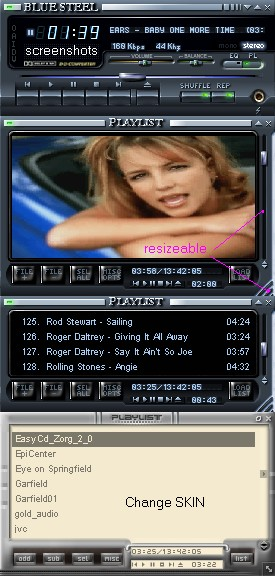



## A MediaPlaylist BETA

### Description

MediaPlaylist a set controls (volume, balance, playlist, position, timer, ...) that plays : AVI, CDA, DivX, MID, MP3, MPG, MOV, WAV. It has a MPG - MP3 tag editor and playlist editor (m3u & pls), Several kinds of sorting the playlist. Drag and Drop from Explorer into playlist. Add shortcuts for desired application. Playmode : Repeat 0,1, all, Shuffle or not. Support winamp skins (wsz not jet). Requires only MsFlxGrd.ocx and DivX code, it's a totaly replacement for the mci.ocx. (mciPlayer = Winamp Clone).
 
### More Info
 

             |
---                |---
**Submitted On**   |2002-09-18 20:36:12
**By**             |[Alkiman](https://github.com/Planet-Source-Code/PSCIndex/blob/master/ByAuthor/alkiman.md)
**Level**          |Intermediate
**User Rating**    |4.5 (177 globes from 39 users)
**Compatibility**  |VB 4\.0 \(32\-bit\), VB 5\.0, VB 6\.0, VBA MS Access
**Category**       |[Sound/MP3](https://github.com/Planet-Source-Code/PSCIndex/blob/master/ByCategory/sound-mp3__1-45.md)
**World**          |[Visual Basic](https://github.com/Planet-Source-Code/PSCIndex/blob/master/ByWorld/visual-basic.md)
**Archive File**   |[A\_MediaPla1327819182002\.zip](https://github.com/Planet-Source-Code/alkiman-a-mediaplaylist-beta__1-12171/archive/master.zip)

